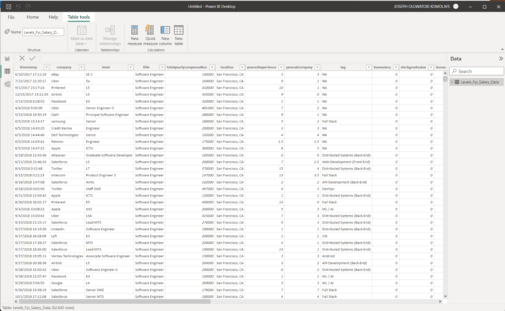

# Data Science Stem Salaries Analysis.

## Introduction
Every job seeker needs information about the salaries of the job roles they are seeking to get. This work looks at analysing Data Science and STEM salaries of four social media companies (Facebook, Twitter, GitHub and LinkedIn) at various career levels, from entry roles to Executive levels. Different factors like locations, departments, genders, and job titles were considered. 

This work examines salaries in the industry at various career levels, from entry to executive, for four companies: Facebook, Twitter, GitHub, and LinkedIn. Wage disparities and norms are investigated in this report across work locations, demographics, years of experience, and job titles. The purpose of this report is to evaluate the differences in current average pay in these four companies and to suggest potential variables that may influence better compensation negotiations.

## BI Questions
This BI project aims to create a comparison of average salaries across the selected firms and to allow people looking to transition into tech careers or job seekers to compare pay across various levels, function descriptions, and company locations. The analysis is primarily concerned with the following issues:
- To ascertain how experience affects pay.
- To compare the annual salary differences between departments and units.
- Gain an understanding of the demographics of the company's workforce by demonstrating the impact of demographics on average earnings.
- To display the variation in average incomes worldwide and the dispersion of job locations.

## Data Source
The dataset was compiled from levels.fyi. the website is typically thought to be more accurate in terms of actual tech pay and makes it simple to compare different career levels across different firms. The extracted data from the website was gotten from Kaggle via the link: https://www.kaggle.com/datasets/jackogozaly/data-science-and-stem-salaries. There are 29 columns and 62642 rows in the dataset. 

## Skills Demonstrated
- DAX
- M Language
- Quick Measures
- Modelling
- ETL
- Filters
- Tooltips

## Data Transformation
The pre-processing steps for the Data Science & STEM salary dataset start with importing the dataset from my local computer to powerbi. The dataset is in csv format already. To fetch the dataset, click ‘Get Data’, click ‘Text/CSV and connect. After loading the dataset to powerbi, the following cleaning steps were carried out:
-	Due to the large size of the dataset, this work focused on four social media companies (Facebook, Twitter, GitHub and LinkedIn). These companies were filtered out from the company column.
-	Two errors were removed when uploading the dataset
-	Renamed the levels with L2 – L10
-	NA in Tag, gender, race, education, and other details changed to ‘Not known’.
-	Dmaid column was removed as it is not needed in the work.
-	Years of experience were changed from decimal to whole numbers
-	New custom column named ‘Education level’ was created and regrouped
-	New custom column named ‘Ethnicity’ was created to combine all races.
-	Columns not needed were removed
-	Career level column was created using DAX.

Before Preprocessing         |        After Preprocessing
:---------------------------:|:----------------------------:
|
