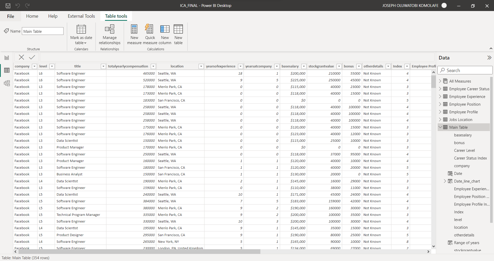
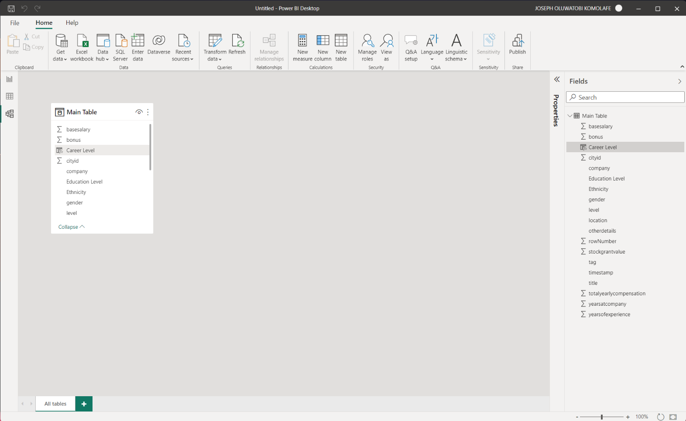
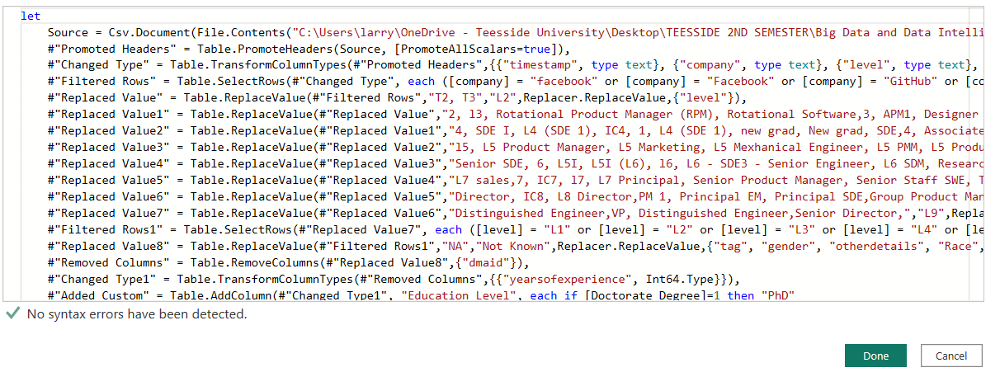
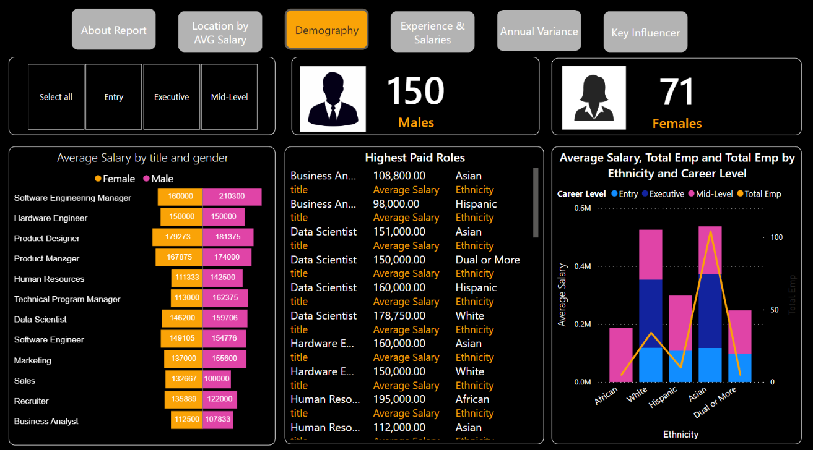
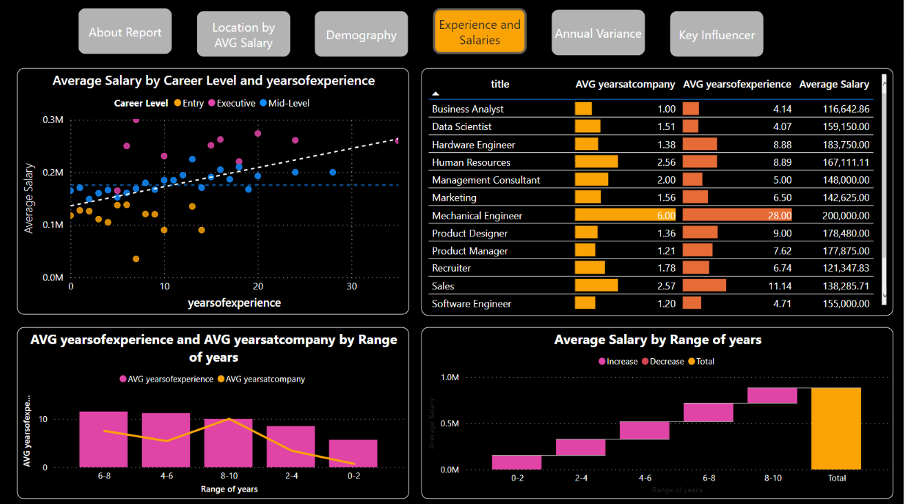
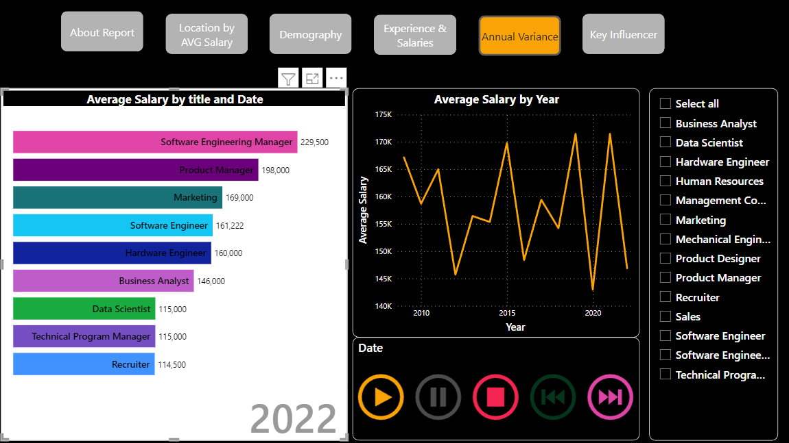
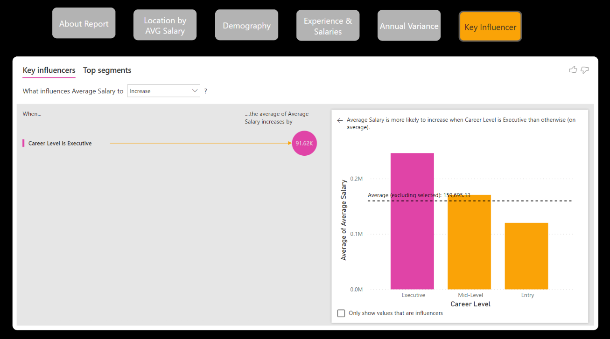
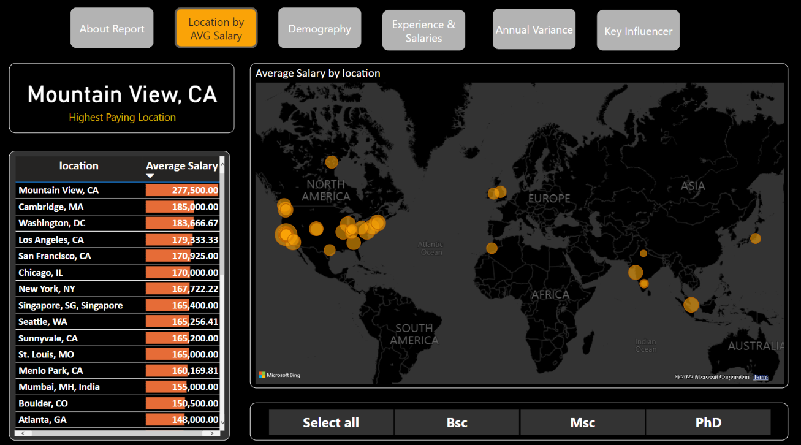

# Data Science Stem Salaries Analysis.

## Introduction
Every job seeker needs information about the salaries of the job roles they are seeking to get. This work looks at analysing Data Science and STEM salaries of four social media companies (Facebook, Twitter, GitHub and LinkedIn) at various career levels, from entry roles to Executive levels. Different factors like locations, departments, genders, and job titles were considered. 

This work examines salaries in the industry at various career levels, from entry to executive, for four companies: Facebook, Twitter, GitHub, and LinkedIn. Wage disparities and norms are investigated in this report across work locations, demographics, years of experience, and job titles. The purpose of this report is to evaluate the differences in current average pay in these four companies and to suggest potential variables that may influence better compensation negotiations.

## BI Questions
This BI project aims to create a comparison of average salaries across the selected firms and to allow people looking to transition into tech careers or job seekers to compare pay across various levels, function descriptions, and company locations. The analysis is primarily concerned with the following issues:
- To ascertain how experience affects pay.
- To compare the annual salary differences between departments and units.
- Gain an understanding of the demographics of the company's workforce by demonstrating the impact of demographics on average earnings.
- To display the variation in average incomes worldwide and the dispersion of job locations.

## Data Source
The dataset was compiled from levels.fyi. the website is typically thought to be more accurate in terms of actual tech pay and makes it simple to compare different career levels across different firms. The extracted data from the website was gotten from Kaggle via the link: https://www.kaggle.com/datasets/jackogozaly/data-science-and-stem-salaries. There are 29 columns and 62642 rows in the dataset. 

## Skills Demonstrated
- DAX
- M Language
- Quick Measures
- Modelling
- ETL
- Filters
- Tooltips

## Data Transformation
The pre-processing steps for the Data Science & STEM salary dataset start with importing the dataset from my local computer to powerbi. The dataset is in csv format already. To fetch the dataset, click ‘Get Data’, click ‘Text/CSV and connect. After loading the dataset to powerbi, the following cleaning steps were carried out:
-	Due to the large size of the dataset, this work focused on four social media companies (Facebook, Twitter, GitHub and LinkedIn). These companies were filtered out from the company column.
-	Two errors were removed when uploading the dataset
-	Renamed the levels with L2 – L10
-	NA in Tag, gender, race, education, and other details changed to ‘Not known’.
-	Dmaid column was removed as it is not needed in the work.
-	Years of experience were changed from decimal to whole numbers
-	New custom column named ‘Education level’ was created and regrouped
-	New custom column named ‘Ethnicity’ was created to combine all races.
-	Columns not needed were removed
-	Career level column was created using DAX.

Before Preprocessing         |        After Preprocessing
:---------------------------:|:----------------------------:
| 

## Data Modelling via Star Schema
The data model addresses the following BI questions as stated earlier:
-	To ascertain how experience affects pay.
-	To compare the annual salary differences between departments and units.
-	Gain an understanding of the demographics of the company's workforce by demonstrating the impact of demographics on average earnings.
-	To display the variation in average incomes worldwide and the dispersion of job locations.
The model is separated into six tables. One fact table and 5 dimension tables (Employee Experience, Employee Profile, Employee Career Status, Jobs Location, Employee Position). The fact table is named ‘Main Table’. 

Before Modelling             |        After Modelling
:---------------------------:|:----------------------------:
| 

-	The Employee Career status dimension table stores information about career level, career status index, company, and level. **The career Status Index** is the key connecting this table to the Main Table.
-	Jobs Location dimension table stores information about the index and location. **Location** is the key connecting this table to the Main Table.
-	Employee Position dimension table stores information about company, Employee Position Index, tag, and title. **Employee Position Index** is the key connecting this table with the Main Table.
-	Employee Experience dimension table stores information about company, Employee Experience Index, years at company, and years of experience. **Employee Experience Index** is the key connecting this table to the Main Table.
-	Employee Profile dimension Table stores information about Education Level, Employee Profile Index, ethnicity, and gender. **Employee Profile Index** is the key connecting this table with the Main Table.

## DAX 
Dax was used to calculate the range of years spent at the companies.

## M - Language.
M-Language was used to change titles and group career levels.

## Data Analysis Visuals
This report comprises 4 pages:
- Demography

- Experience & Salary

- Annual Variance

- Key Influencer

- Location

## Key Findings
- Mountain View in California USA is the highest-paid location across all companies considered with an average salary of $277,500. Bangalore, India and Delhi India are the least paid across the four companies with average salaries of $40,000 and $35,000 respectively.
-	Highest paying location for degree holders is Washington DC with an average Salary of $225,000.
-	A male software engineering manager earned an average salary of $210300 in comparison to a female colleague that earned $160000. It shows a wide margin between the male and female roles. Data Scientists are paid $159706 for males and $146200 for females while female Business analysts earned more than males with $112500 and $107833 respectively.
-	The total number of males is 150 which is twice the number of females in all four firms.
-	We have 44 males and 25 males at the Entry level, 91 Males and 41 Females at the Mid-level, and 8 Males and 4 females at the Executive level.
-	Product Designers that are white earn the highest salary of about $220500.  Also, white workers in Human Resources earn the least with a $90000 salary.
-	For all classes of career status, there is a moderately significant correlation between earnings and years of work experience.
-	The average number of years of experience for entry-level data scientists and business analysts is four, with an average tenure of 1.5 years.
-	Employees with 10 years of experience have stayed with the company for an average of 8-10 years, whereas employees with 0-2 years of work experience have stayed for less than a year.
-	The lowest average earnings are approximately $151000 in the range of 0-2 years and the highest average earnings are approximately $165000 in the range of 8-10 years.
-	In 2022, the highest-paid role was Software Engineering Manager with an average income of $229,500. The highest-paid role in 2021 was Product Manager with an average income of $252,000.
-	The highest contributor is the Executive career level which raises the average income by more than $91,000. 

## Conclusion & Recommendation
-	The average earnings in Bangalore, India and Delhi India should be adjusted over time because they are the least paid locations.
-	Most of the locations are in North America and Asia. While Africa only has one location in Rabat Morocco. This should be investigated as the technology market is growing in Africa as well. This will create more followers for the four companies and in turn increase revenue coming from the region.
-	Attention should be given to entry-level salaries, which are lower than the international labour standard.
-	More women should be encouraged to go into these roles for gender equality and societal growth.
-	Salary increments should be done on regular basis as well as it was observed that the most significant increase happens after some years.

You can interact with the report [here](https://app.powerbi.com/links/PUu8fkmgUb?ctid=d03c2d35-3db6-4e31-acbc-a7f9acd28c9d&pbi_source=linkShare)
